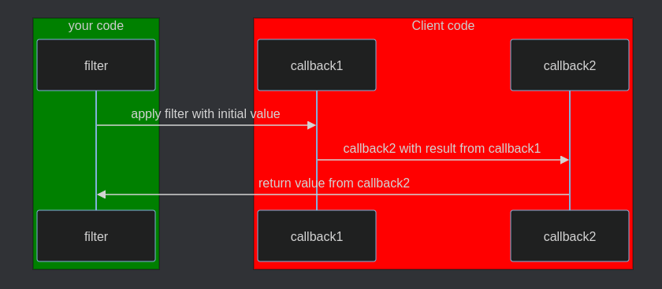

<!-- Original script by Cyrille C: https://github.com/CrochetFeve0251 -->

# Developing with hooks

As you dive deeper into developing with WordPress hooks there are some details about how hooks work that are valuable to understand.

In this lesson, you'll learn some good practices to follow when developing with hooks.

## Naming hooks

The first good practice involves naming your hooks. Let's look at some conventions that WordPress core follows.

### Actions

Actions are usually added when something changes, so it's advisable for you to use a verb related to that change in the action hook name.

For example, the WordPress core action hook that's triggered when a post is deleted is named `delete_post`.

```php
do_action( 'delete_post' );
```

If you want to add an action before the actual change, you can prefix it with `pre_`.

```php
do_action( 'pre_delete_post' );
```

Finally, if you want to add an action after the actual event, the convention is to use a past tense in the name.

```php
do_action( 'deleted_post' );
```

### Filters

Because filters are generally linked to a variable that can be modified, filter hooks are often named after the variable that can be modified.

For example, the filter hook that allows you to modify the content of a post is named `the_content`.

```php
$content = apply_filters( 'the_content', get_the_content() );
```

### Avoid naming collisions

When naming your hooks, it's important to avoid naming collisions with other plugins or themes. To do this, you can prefix your hook names with your plugin's name or a unique identifier.

```php
do_action( 'wp_learn_delete_book' );

apply_filters( 'wp_learn_lesson_url', 'https://example.org/lesson' );
```

## Handling filter types

When using a filter, the type of the variable that's returned from the filter is not guaranteed, even if it's documented.

### The problem

The reason for this is that the last callback that runs on the filter determines what is returned by the filter.

That might not seem an issue at first, because as a developer you will make sure to return a value with the same type.

However, if you recall from the lesson on Custom Hooks, just as you can hook into actions and filters, so can other developers.



This means that if you add custom hooks to your plugin, you need to ensure that the data returned is the correct type otherwise it might break your plugin's functionality.

### The solution

The solution for this comes in two parts:

#### Validating your filter output

The best way to make sure the value returned from any filter callbacks stays the type you expect is to validate the data type in your code.

For primitive types like integer, float or boolean, you can use [PHP's type casting](https://www.php.net/manual/en/language.types.type-juggling.php#language.types.typecasting) system, to ensure the return value is the correct type:

- `boolean`: `$is_admin = (bool) apply_filters( 'wp_learn_is_admin', true );`
- `integer`: `$book_count = (int) apply_filters( 'wp_learn_book_count', 10 );`
- `float`: `$base_price = (float) apply_filters( 'wp_learn_base_price', 10.0 );`

However, for more complex validation or other types, it is better to implement a more manual validation check.

For example, for a string or an array, it would be better to check if the returned value is the right type rather than using casting, as this could lead to a PHP fatal error.

For example, you can use the PHP `is_string()` [function](https://www.php.net/manual/en/function.is-string.php) to check if the value returned from any hooked callbacks is a string:

```php
$book_slug = apply_filters( 'wp_learn_book_slug', 'books' );

if ( ! is_string( $book_slug ) ) {
    // either reset the value or throw an error
}
```

If not, you can either reset the value or throw an error.

#### Assert your callbacks value

The fact that the type of the variable returned from a filter can be modified also means that an incorrectly typed variable can be passed to any hooked callback.


Therefore, if you hook a callback function into a filter, it is important to always check the type of the value you receive before performing any operation on it.

```php
add_filter( 'wp_learn_book_slug', 'jon_doe_edit_book_slug' );
function jon_doe_edit_book_slug( $book_slug ) {
    if ( ! is_string( $book_slug ) ) {
        // throw some error because the type is incorrect 
    }
    
    // continue with your functionality because the type is correct
    return 'book';
}
```

You can use the same methods as before to validate the type of the variable you receive.

For more information on PHP's type jugging, you can refer to the [PHP documentation](https://www.php.net/manual/en/language.types.type-juggling.php). 

There's also a section dedicated to the various [Variable handling functions](https://www.php.net/manual/en/ref.var.php).

## Getting information on a hook

Another good thing to know about hooks is how to get information about them.

### Determining the current hook

WordPress allows a callback function or method to be used on more than one hook. 

Due to this, it can be sometimes unclear on which hook the callback is actually running.

In any callback function it is possible to use the [`current_filter`](https://developer.wordpress.org/reference/functions/current_filter/) or [`current_action`](https://developer.wordpress.org/reference/functions/current_action/) functions to determine the current filter or action the callback is running on.

### Check how many times a hook has run

Sometimes it is important to know if a hooked callback has already run to prevent it from running again.

Inside any callback function, you can use the [`did_filter`](https://developer.wordpress.org/reference/functions/did_filter/) function to check how many times a filter has been applied during the current request and the [`did_action`](https://developer.wordpress.org/reference/functions/did_action/) function to check how many times an action has been applied.

